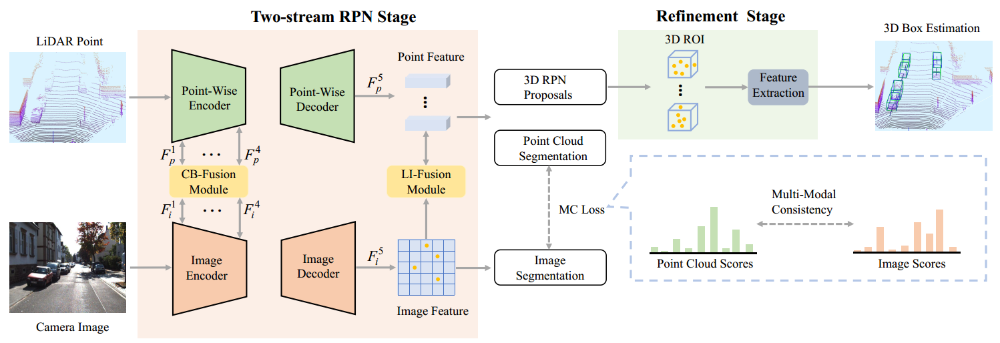

# EPNet++

EPNet++: Cascade Bi-directional Fusion forMulti-Modal 3D Object Detection (TPAMI 2022).

Paper is now available in [IEEE Explore](https://ieeexplore.ieee.org/abstract/document/9983516) or Arxiv [EPNet++](https://arxiv.org/pdf/2112.11088v4.pdf) , and the code is based on [EPNet](https://github.com/happinesslz/EPNet) and [PointRCNN](https://github.com/sshaoshuai/PointRCNN).

## Abstract

Recently, fusing the LiDAR point cloud and camera image to improve the performance and robustness of 3D object detection has received more and more attention, as these two modalities naturally possess strong complementarity. In this paper, we propose EPNet++ for multi-modal 3D object detection by introducing a novel Cascade Bi-directional Fusion (CB-Fusion) module and a Multi-Modal Consistency (MC) loss. More concretely, the proposed CB-Fusion module enhances point features with plentiful semantic information absorbed from the image features in a cascade bi-directional interaction fusion manner, leading to more powerful and discriminative feature representations. The MC loss explicitly guarantees the consistency between predicted scores from two modalities to obtain more comprehensive and reliable confidence scores. The experimental results on the KITTI, JRDB and SUN-RGBD datasets demonstrate the superiority of EPNet++ over the state-of-the-art methods. Besides, we emphasize a critical but easily overlooked problem, which is to explore the performance and robustness of a 3D detector in a sparser scene. Extensive experiments present that EPNet++ outperforms the existing SOTA methods with remarkable margins in highly sparse point cloud cases, which might be an available direction to reduce the expensive cost of LiDAR sensors.




## Install(Same with [PointRCNN](https://github.com/sshaoshuai/PointRCNN))

The Environment：
* Linux (tested on Ubuntu 16.04)
* Python 3.7.6
* PyTorch 1.20 + CUDA-10.0/10.1

a. Clone the EPNet++ repository.
```shell
git clone https://github.com/happinesslz/EPNetV2.git
```

b. Create conda environment.

```shell
conda create -n epnet_plus_plus_open python==3.7.6
conda activate epnet_plus_plus_open
conda install pytorch==1.2.0 torchvision==0.4.0 cudatoolkit=10.0 -c pytorch
pip install -r requirements.txt
```

c. Build and install the `pointnet2_lib`, `iou3d`, `roipool3d` libraries by executing the following command:
```shell
sh build_and_install.sh
```

## Dataset preparation
Please download the official [KITTI 3D object detection](http://www.cvlibs.net/datasets/kitti/eval_object.php?obj_benchmark=3d) dataset and our provided [train mask](https://drive.google.com/file/d/1XqqErkAl8t72HM65PJfZC6SQ1oeBF4X0/view?usp=share_link) based on the [KINS dataset](https://github.com/qqlu/Amodal-Instance-Segmentation-through-KINS-Dataset). Then organize the downloaded files as follows: 

```
EPNetV2
├── data
│   ├── KITTI
│   │   ├── ImageSets
│   │   ├── object
│   │   │   ├──training
│   │   │      ├──calib & velodyne & label_2 & image_2 & (optional: planes) & train_mask
│   │   │   ├──testing
│   │   │      ├──calib & velodyne & image_2
├── lib
├── pointnet2_lib
├── tools
```


## Trained model
The results of Car on Recall 40:

| Models |   Easy | Moderate |   Hard |
| :--:   |  :--:  |   :--:  |   :--:  |
|  Car  | 92.98 |  83.45  | 82.44 |
|  Pedestrian  | 77.70 |  70.20  | 63.80 |
|  Cyclist  | 86.86 |  64.11  | 60.24 |

To evaluate all these models, please download the above  models from  [Google](https://drive.google.com/file/d/1k7Ugvz5AYJhmrLAvnOt-ZFhNntmB8DZe/view?usp=share_link) or [Baidu Pan](https://pan.baidu.com/s/1GhGgekaob1b_P3d4vWtpbg) (1rw2). Unzip these models  and move them to "./tools". Then run:
```shell
bash run_all_eval_epnet_plus_plus_models.sh
```
## Implementation
### Training & Inference
```shell
bash run_train_and_eval_epnet_plus_plus_car.sh
bash run_train_and_eval_epnet_plus_plus_ped.sh
bash run_train_and_eval_epnet_plus_plus_cyc.sh
```
## Acknowledgement
Thanks for the superior open-source project [PointRCNN](https://github.com/sshaoshuai/PointRCNN). Thanks for all co-authors.

## Citation
If you find this work useful in your research, please consider cite:
```
@article{liu2022epnet++,
  title={EPNet++: Cascade bi-directional fusion for multi-modal 3D object detection},
  author={Liu, Zhe and Huang, Tengteng and Li, Bingling and Chen, Xiwu and Wang, Xi and Bai, Xiang},
  journal={IEEE Transactions on Pattern Analysis and Machine Intelligence},
  year={2022},
  publisher={IEEE}
}
```

```
@article{Huang2020EPNetEP,
  title={EPNet: Enhancing Point Features with Image Semantics for 3D Object Detection},
  author={Tengteng Huang and Zhe Liu and Xiwu Chen and Xiang Bai},
  booktitle ={ECCV},
  month = {July},
  year={2020}
}
```
```
@InProceedings{Shi_2019_CVPR,
    author = {Shi, Shaoshuai and Wang, Xiaogang and Li, Hongsheng},
    title = {PointRCNN: 3D Object Proposal Generation and Detection From Point Cloud},
    booktitle = {The IEEE Conference on Computer Vision and Pattern Recognition (CVPR)},
    month = {June},
    year = {2019}
}
```


